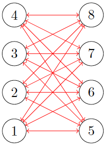
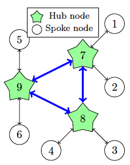

# FreshFarm Delivery Network Optimization

[Final Report (PDF)](<hub_and_spoke.pdf>)

FreshFarm, a company specializing in perishable farm product delivery across a vast network of *N* cities, faces the critical challenge of ensuring the swift and efficient transportation of these perishable goods. Given the limited shelf life of their products and the necessity to reach customers across the entire country, FreshFarm is contemplating the implementation of a hub-and-spoke network model.

## Network Configurations

### Point-to-Point Network

In a point-to-point network configuration, each city pair has a dedicated direct route between them regardless of the volume of flow. See the example in the figure below.

### Hub-and-Spoke Network

In contrast, in a hub-and-spoke network configuration, each city is designated to a central hub city as seen in the figure below. Deliveries from a source city to its (single) respective hub city and subsequently to the destination city occur via the destination city’s hub (for example, delivery of a package from city 1 to city 6 would first travel to cities 7 and 9 before arriving at city 6).

## Optimization Challenge

Assuming the distance between cities is calculated using the Euclidean distance formula, a direct route between any two cities is always the shortest path. In this scenario, a city can serve as its own hub. Furthermore, if two cities are designated as hub cities, the route connecting them will be direct. FreshFarm aims to optimize its network to identify the most efficient configuration for delivering goods, taking into account the varying delivery volumes between city pairs and the distances separating them.

For example, if there is a high volume of deliveries between two cities, it may be more efficient to establish a direct route, thereby designating these cities as their own hubs. On the other hand, cities with lower delivery volumes could benefit from routing their packages through one or more hub cities. This setup allows for delivery consolidation and cost reduction by pooling lower-volume deliveries together en route to their final destinations.
